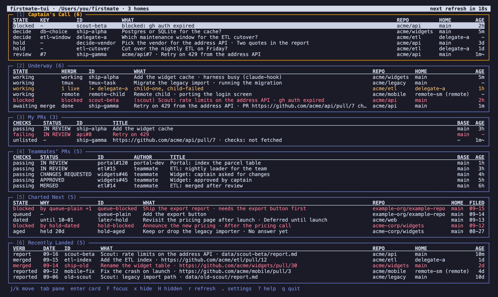

# firstmate-tui

firstmate-tui is a live terminal board over the work your coding agents are doing for you, plus the pull requests waiting on you.
It reads the state that [firstmate](https://github.com/kunchenguid/firstmate), a supervisor that runs coding agents from a checkout on your machine, keeps on disk.
It asks GitHub about your pull requests, and it asks [herdr](https://herdr.dev), the terminal multiplexer those agents run in, which agent panes are still alive.
All of it lands on one screen that refreshes itself: what needs your answer, your own pull requests and their checks, the pull requests teammates asked you to review, what is being worked on right now, the reports the agents wrote, and what shipped.
You want it when several agents work for you at once and scrolling back through a chat no longer tells you where things stand.
The board is read-only.
It never writes into firstmate's files, never answers a question on your behalf and never merges anything.
Its only actions are jumping to an agent's pane, opening a pull request in your browser and showing a report in the terminal.



The screenshot is from an earlier release with five panes and one pull request pane.
The current board has the six panes listed under [Using the board](#using-the-board).

## Prerequisites

Two words this README uses that are firstmate's own:

- A **firstmate home** is a checkout of the firstmate repository that firstmate runs from, with its `bin/` scripts and the `state/` and `data/` directories it fills.
  The board reads one main home, the one `FM_HOME` points at.
- firstmate can hand part of its work to a second copy of itself running from another home.
  firstmate calls that copy a secondmate; this README calls it a **delegate home**.
  The board finds delegate homes through the main home's `data/secondmates.md` and lists their work too.

### Required

The launcher checks the firstmate home, Node and herdr before it starts and stops with a message when one is missing.
Nothing checks bash or jq up front.

**bash 3.2 or newer.**
The `firstmate-tui` command and the installer are bash scripts.
macOS ships bash 3.2 and Linux ships 5.x, so there is nothing to install.
Check: `bash --version` prints the version on its first line.

**A firstmate home, in `FM_HOME`.**
The board runs that home's `bin/fm-fleet-snapshot.sh` for its data on every refresh.
The launcher stops unless `FM_HOME` names a directory holding an executable `bin/fm-fleet-snapshot.sh`; it never guesses the path from where you started it.
Check: `ls "$FM_HOME/bin/fm-fleet-snapshot.sh"` prints the path instead of an error.
Get one: `git clone https://github.com/kunchenguid/firstmate.git ~/firstmate` (any path works), then put `export FM_HOME=$HOME/firstmate` in your shell profile so it is set in every terminal.

**herdr 0.8.2 or newer.**
herdr hosts the board's pane and tells it which agent panes are alive.
The launcher checks that a `herdr` command is on `PATH`.
The 0.8.2 minimum is the one the board's plugin manifest declares, and herdr enforces it when you link the plugin.
`--no-herdr` runs the board without herdr; the title line then says so.
Check: `herdr --version` prints `herdr 0.8.2` or higher.
Install: macOS `brew install herdr`.
Linux, or macOS without Homebrew: `curl -fsSL https://herdr.dev/install.sh | sh`.
herdr's install page, https://herdr.dev/install, covers the other routes and `herdr update`.

**Node 20 or newer.**
Node runs the board.
The launcher reads Node's major version and stops below 20.
npm is needed only for the [development install](#development), because a release tarball already carries the one dependency.
Check: `node --version` prints `v20` or higher.
Install: macOS `brew install node`.
Debian and Ubuntu: `sudo apt install nodejs` when the packaged version is 20 or newer (Ubuntu 24.04 packages Node 18, which is too old), otherwise the packages and version managers at https://nodejs.org/en/download.

**jq 1.5 or newer.**
jq is a command that reads JSON.
`firstmate-tui open --detached` and `firstmate-tui focus` read herdr's answers with it; the board itself does not use it.
Nothing checks for it up front, so those two commands fail without it.
Check: `jq --version` prints `jq-1.5` or higher.
Install: macOS `brew install jq`.
Debian and Ubuntu: `sudo apt install jq`.
Other systems: https://jqlang.github.io/jq/download/.

**For the installer: curl, tar, and sha256sum or shasum.**
The installer downloads the release with curl, unpacks it with tar and verifies the checksum with sha256sum or, when that is missing, shasum.
It checks for all three before it downloads anything and names the missing one.
All of them ship with macOS and with every common Linux.
Check: `curl --version`, `tar --version` and `shasum --version` (or `sha256sum --version`) each print a version.
Install, Debian and Ubuntu, when one is missing: `sudo apt install curl tar coreutils`.

### Optional

**gh, the GitHub CLI, logged in.**
gh gives the two pull request panes their data.
On every refresh the board runs `gh api graphql` itself, at most four searches plus one lookup, and once per session `gh api user` for your GitHub login unless the [config file](#configuration) names it.
Without gh on `PATH`, My PRs falls back to a firstmate script that needs gh as well, so in practice that pane reports a failed fetch, and Teammates' PRs reads `gh not on PATH: Teammates' PRs needs the GitHub CLI`.
`--no-prs` runs the board without any GitHub call; the two panes then list only the pull request links firstmate recorded.
Check: `gh auth status` prints `Logged in to github.com`.
Install: macOS `brew install gh`.
Debian and Ubuntu: `sudo apt install gh`, or the packages at https://github.com/cli/cli/blob/trunk/docs/install_linux.md.
Then run `gh auth login` once.

**glow.**
glow renders a Markdown report in the terminal when you press `enter` on a Findings row.
Without it the board uses `$EDITOR`, then `vim`, then `less`.
Check: `glow --version`.
Install: macOS `brew install glow`.
Linux: the packages listed at https://github.com/charmbracelet/glow.

**python3, for the test suite only.**
The last section of `tests/fm-board.test.sh` drives the real board on a pseudo-terminal through a Python script.
Without python3 that section is skipped with a note.
Check: `python3 --version`.
Install: macOS `brew install python@3`.
Debian and Ubuntu: `sudo apt install python3`.

## Install

One command installs the latest stable release:

```sh
curl -fsSL https://raw.githubusercontent.com/zachsibert/firstmate-tui/main/bin/install.sh | bash
```

It asks GitHub for the latest release, downloads the release tarball `firstmate-tui-<tag>.tar.gz` and its `.sha256` file, verifies the checksum, unpacks the tarball and writes the command.
A failed download or a checksum mismatch stops it before anything is replaced.
It writes three things and nothing else: no shell profile, no herdr config.

| What | Where |
| --- | --- |
| The files | `~/.local/share/fm-board`, or `$XDG_DATA_HOME/fm-board` when that variable is set. This is the prefix. The directory keeps the board's former name, so an upgrade moves nothing |
| The command | `~/.local/bin/firstmate-tui`, a one-line script that runs the launcher inside the prefix. `~/.local/bin/fm-board` is written beside it as an alias, the command's former name, and goes away in the next release |
| The install record | `<prefix>/install-record`, a key=value file naming the prefix, the bin dir, the repository, the installed version and the tarball layout. `firstmate-tui upgrade` reads it |

When the bin dir is not on your `PATH`, the installer ends with this line:

```
install: note: /Users/you/.local/bin is not on your PATH; add it, or run /Users/you/.local/bin/firstmate-tui by its full path
```

Add `export PATH="$HOME/.local/bin:$PATH"` to your shell profile yourself; the installer never edits it.
For other locations add the flags after `bash -s --`, for example `bash -s -- --prefix /opt/firstmate-tui --bin-dir /usr/local/bin`.
`bin/install.sh --help` lists every flag, including `--from-file <tarball>` for a tarball you already have.
To uninstall, delete the prefix directory and the `firstmate-tui` and `fm-board` commands in the bin dir.

### Link the herdr plugin (once)

Linking registers the board's plugin manifest with herdr.
After that herdr's command palette has two entries, one that opens the board in a tab pane and one that focuses it, and `firstmate-tui open --detached` places the board in a tab pane of the current workspace instead of a hidden workspace.
Linking is optional: without it `firstmate-tui` still runs in whatever terminal you type it in.
It is also user-global, so it affects every herdr session on the machine.

```sh
herdr plugin link ~/.local/share/fm-board/bin/firstmate-tui
echo "$FM_HOME" > "$(herdr plugin config-dir firstmate.board)/fm-home"
```

The second line matters because a palette action carries no environment: the plugin reads `FM_HOME` from that `fm-home` file.
To bind a key to the focus action, add this to `~/.config/herdr/config.toml`:

```toml
[[keys.command]]
key = "prefix+y"
type = "plugin_action"
command = "firstmate.board.focus"
```

A plugin linked before 0.3.0 points at `.../bin/fm-board`, a directory the upgrade removed.
Run `herdr plugin unlink firstmate.board` once and link the new path as above; the plugin id stays, so the config directory and the `fm-home` file are kept.

### First run

```sh
export FM_HOME=/path/to/your/firstmate/home
firstmate-tui
```

The launcher checks the home, Node and herdr, then the board fills the terminal with six bordered panes.
Each pane's body starts with a spinner line naming what it waits on (the fleet snapshot, the GitHub checks or the GitHub review requests) until that data first lands, about five seconds for the snapshot and a few more for GitHub.
The first launch also writes the board's config file from the shipped example, so you have a real file to edit; [Configuration](#configuration) says where it lives and what is in it.
Press `?` inside the board for the keys, `.` for the Settings page and `q` to quit.

Without `FM_HOME` the launcher stops and prints two commands to copy: the `export` for a terminal launch and the `mkdir` plus `echo` that write the plugin's `fm-home` file.
When a firstmate home sits above the current directory the `export` names it, but the board never adopts one on its own.

The two pull request panes are built around one GitHub login, yours.
The board takes it from the config file's `identity.github_login` when set, else from the account gh is logged in as (`gh api user`, once per session), else from git's `github.user` setting.
When none of the three answers, both panes show one row, `identity unknown: see Settings (.)`, and fetch nothing; [Troubleshooting](#troubleshooting) has the fix.

Inside herdr, `firstmate-tui` runs in the pane you type it in.
To put the board beside firstmate, split the pane first (herdr's defaults are `ctrl+b` then `v` for a pane to the right and `ctrl+b` then `-` for one below), run `firstmate-tui` in the new pane, and close that pane yourself when done.
`firstmate-tui open --detached` opens the board away from your terminal instead, in its own herdr pane, and `firstmate-tui focus` brings that pane forward later.

## Upgrade and betas

`firstmate-tui version` prints what is installed and where:

```
firstmate-tui 0.4.2 (stable release)
installed at /Users/you/.local/share/fm-board (from release v0.4.2); firstmate-tui upgrade replaces it
```

A stable release is numbered `X.Y.Z`.
A beta is that number plus the short hash of the commit it was built from, such as `0.4.2-d8b290e`; every push to a branch other than `main` publishes one as a GitHub prerelease, so a beta names one exact commit you can install.
On a beta the first line reads `firstmate-tui 0.4.2-d8b290e (beta: 0.4.2 at commit d8b290e)`.
Betas are deleted when their pull request closes, and at most 30 are kept at a time, so a beta is for trying a branch, not for staying on.

```sh
firstmate-tui upgrade                            # to the latest stable release
firstmate-tui upgrade --pre                      # to the newest release, betas included
firstmate-tui upgrade --version 0.4.2-d8b290e    # to one exact version, beta or release (v0.4.2 works too)
firstmate-tui upgrade --stable                   # from a beta back to the latest stable release
```

`firstmate-tui upgrade` runs the installer that shipped inside your install against the prefix and bin dir in the install record.
It downloads and verifies the new tarball, unpacks it beside the install and swaps the whole directory in, so a failed download or checksum leaves what you have.
Versions are never compared, so going back is the same step as going forward.
Your config file and view state live outside the prefix and come through unchanged.
The same three flags work on the install command after `bash -s --`, which is how to start on a beta with nothing installed yet.
From a git checkout, `firstmate-tui upgrade` refuses and prints the `git pull` that updates a checkout instead.

**From inside the board.**
Press `.` for the Settings page.
It shows the running version, where it is installed and from which release, the latest stable release with its date and a verdict (`upgrade available`, `up to date`, or that you are on a beta), the launch flags in effect, and the identity and config file the pull request panes use.
From an install it offers `Upgrade to <version>`, a **Betas** submenu listing the prereleases newest first with their commit and date, and `Back to stable`.
Choosing one shows the exact command it stands for and asks `y to confirm, esc to cancel`; only `y` runs it, through the same `firstmate-tui upgrade` as the command line, with the installer's lines appearing on the page.
On success the page reads `restart to use <version>` and `R` restarts the board on the new copy.
A failure leaves the installer's output on the page and the current install untouched.
`r` fetches the release list again; `.`, `esc` or `q` returns to the board.
Release data is fetched only when the page opens and on `r`, never on the refresh tick.

**Older installs.**
Since 0.3.0 the tarball is `firstmate-tui-<tag>.tar.gz`; up to 0.2.x it was `fm-board-<tag>.tar.gz` with `bin/fm-board.sh` and `bin/fm-board/` inside.
The current installer knows both names and both layouts, so `firstmate-tui upgrade --version 0.2.6` still goes back to a 0.2.x release.
An install at 0.2.5 or 0.2.6 should run the install command above once more, because the installers that shipped in those two versions stop on a missing asset instead of trying the other name; after that reinstall `firstmate-tui upgrade` works as usual.
An install older than 0.2.5 first runs its own `fm-board upgrade --version 0.2.5`, the last release under the old asset name, and then reinstalls the same way.

## Using the board

The six panes, top to bottom; each pane's key is its number:

1. **Needs you**: what firstmate is waiting on you for: blocked agents, decisions to make, holds you set with their due dates, and one `review` row per pull request that is yours to review because its agent is done and GitHub reports the pull request open and mergeable.
2. **My PRs**: every open pull request your GitHub login authored, in any repository, plus the pull requests recorded on unfinished firstmate tasks whoever opened them, plus either kind that merged or closed in the last 12 hours; the columns are CHECKS, STATUS, ID, TITLE, BASE (the branch it targets) and AGE.
3. **Teammates' PRs**: the open pull requests where you are a requested reviewer, directly or through a team, and not the author, in the repositories firstmate works in plus the ones the config file names, filtered by the config file's label rules, with the same columns plus AUTHOR.
4. **In flight**: one row per agent working in the main home, with firstmate's state (`working`, `awaiting merge`, `repairing PR`, `done`) beside herdr's live pane count, and one group row per delegate home that expands to its agents.
5. **Findings**: the reports the agents wrote, newest first, from every home.
6. **Landed**: finished work, newest first: merged pull requests and done tasks, with the pull request URL, report path or pane id in WHAT.

The title line names the main home and the number of homes, counts down to the next refresh (`next refresh in 18s`), reads `refreshing...` while one runs (the board prints the trailing dots as a single ellipsis character), and after a failed refresh reads `refresh failed 40s ago, retrying in 20s` in red until a later refresh is clean, while the pane whose data failed carries `(stale)` in its title.
Each pane title carries its key and its row count, as in `[1] Needs you (3)`.
In the HERDR column, `pane lost` in red means herdr no longer has that agent's pane, and `unknown` in grey means herdr is disconnected so the board cannot tell.
The bottom line lists the keys, and `?` shows them all.

| Key or gesture | Action |
| --- | --- |
| `j` / `k`, arrows | move the selection |
| `tab` / `shift-tab` | next / previous pane |
| `enter`, or a double-click | act on the row: open its pull request in your browser; on a Findings row show the report in the terminal viewer; on an In flight group expand or collapse it; on an agent row focus its herdr pane; on a Landed row without a pull request show its report, else focus its pane |
| `l` / `right`, `h` / `left` | expand / collapse the selected In flight group |
| `x`, `X`, `H` | hide the selected row; unhide every row in the pane; show hidden rows greyed and marked `(hidden)` |
| `1` to `6`, `0` | show or hide that pane; show every pane (with all six hidden the board lists these keys) |
| `r` | refresh now: the fleet snapshot, then the GitHub fetch |
| `.` | the Settings page ([Upgrade and betas](#upgrade-and-betas)) |
| `=` | reset every column width to its automatic size |
| `?`, `q` or `ctrl-c` | help overlay; quit |
| click | select that row and focus its pane; a click on a pane title focuses the pane |
| wheel | move the selection three rows in the focused pane |
| drag a column boundary in a pane's header line | resize that column; the width is saved and kept across restarts; a double-click on the boundary resets it |

Only the left mouse button is bound; the right button opens herdr's own pane menu.
While the board runs, your terminal reports mouse events to it, so hold your terminal's text-selection modifier to select text, or start with `--no-mouse`.
Inside herdr the mouse reaches the board with herdr's default `mouse_capture = true`, which passes the mouse to pane programs that ask for it.
Column widths are computed from the values on screen.
Below 100 columns the REPO and AGE columns are dropped (the pull request panes drop BASE instead), and below 80 columns the six panes become one scrolling list with section headers.

### Commands

| Command | Meaning |
| --- | --- |
| `firstmate-tui [flags]`, `firstmate-tui open [flags]` | run the board in this terminal |
| `firstmate-tui open --detached [flags]` | open the board in its own herdr pane and print the pane id |
| `firstmate-tui focus` | bring that detached pane forward |
| `firstmate-tui upgrade [--stable \| --pre \| --version <v>]` | replace the install with another release |
| `firstmate-tui version` | print the installed version and whether it is a stable release or a beta (also `-V`, `--version`) |
| `firstmate-tui help` | the usage page (also `-h`, `--help`); an unknown subcommand prints it and exits 2 |

### Launch flags

Flags go after `open` or directly after `firstmate-tui`.
`firstmate-tui --help` names the common ones.

| Flag | Meaning |
| --- | --- |
| `--refresh <seconds>` | how often the board refreshes, default 30. Each refresh runs the fleet snapshot and then the GitHub fetch. `r` and a herdr event on a known agent pane refresh at once; a tick that lands during a running refresh is skipped |
| `--no-prs` | skip the GitHub fetch and the `gh api user` call. My PRs lists recorded pull request links with `checks: off (--no-prs)`, and Teammates' PRs reads `PR fetch off (--no-prs)` |
| `--home <path>` | add a delegate home (repeatable). Default: `FM_HOME` plus every home in `FM_HOME/data/secondmates.md` |
| `--no-herdr` | run without herdr: no live pane state and no herdr calls |
| `--no-mouse` | ignore the mouse and leave the terminal's own text selection alone |
| `--all-homes-needs` | Needs you also lists every delegate home's open decisions; by default those flag the home's In flight group instead |
| `--config <path>`, `--view-state <path>` | where the board's two files live ([Configuration](#configuration)); a path inside `FM_HOME` is refused |
| `--opener-cmd <argv>` | the command that opens a URL, default `open` on macOS and `xdg-open` on Linux; the URL is appended as one argument |
| `--viewer-cmd <argv>` | the command that shows a Findings report, default `glow -p`, else `$EDITOR`, else `vim`, else `less`; the path is appended |
| `--snapshot-timeout <seconds>` | kill a snapshot run after this long, default 60 |
| `--herdr-cmd <argv>`, `--herdr-socket <path>` | how to reach herdr when `HERDR_BIN_PATH`, `HERDR_SOCKET_PATH` and `herdr status` do not apply |
| `--render-once`, `--fixture`, `--cols`, `--rows`, `--keys`, `--mouse`, `--expand`, `--tags`, `--headless`, `--curl-cmd`, `--install-root` | test mode: print one frame, or run the schedule without a terminal. `bin/firstmate-tui/lib/args.mjs` documents each one |

## Configuration

The board owns two files and writes nowhere else: never into a firstmate home, a project or a `state/` directory.
Both live in the same directory: the one `herdr plugin config-dir firstmate.board` prints when herdr answers, else `$XDG_CONFIG_HOME/fm-board/`, else `~/.config/fm-board/`.
`--config` and `--view-state` override the two paths one at a time.

### config.json

The config file holds the two things about the pull request panes that are yours to set.
When no file exists at startup, the board writes this example, [`docs/config.example.json`](docs/config.example.json), byte for byte, and never touches the file again:

```json
{
  "schema": "firstmate-tui-config.v1",
  "identity": {
    "github_login": null
  },
  "review": {
    "default_labels": [],
    "repos": {
      "MatthewsREIS/gemini": {
        "labels": [
          "ready-to-merge"
        ]
      }
    }
  }
}
```

| Key | Meaning |
| --- | --- |
| `schema` | must be `firstmate-tui-config.v1`; a file with another schema is refused as a whole |
| `identity.github_login` | the GitHub login the two pull request panes are built around, such as `zachsibert`, never a name or an email. `null` means resolve it: the account gh is logged in as, else git's `github.user`, else unknown |
| `review.default_labels` | the labels a pull request must carry one of to be listed in Teammates' PRs, in every repository without its own entry under `repos`; an empty list means no filter |
| `review.repos` | one entry per repository, `"owner/name": { "labels": [...] }`. Each named repository is searched even when firstmate has no work in it, and its `labels` list is its own rule; an empty list means no filter there whatever `default_labels` says |

Unknown keys are ignored.
A malformed file (bad JSON, a wrong type, a repository name that is not `owner/name`) is reported once in the footer and on the Settings page, and the board runs with the defaults: no login from the file, no label rules, no extra repositories.
The Settings page (`.`) shows the identity and where it came from, such as `Identity  zachsibert  (from gh api user)`, the config file's path with `(created from the example)` or `(using defaults: <reason>)` when that applies, and the label rules in effect.

### view-state.json

The view state remembers what you hid and how you sized the columns: hidden rows (by pane, home and id, plus the completion date for Landed, so an item that lands again reappears), hidden panes, and every column width you dragged.
firstmate retires done rows on its own, so hiding a row is the board's business and never a firstmate write.
`=` resets every column width, and the Settings page has a `Reset column widths` entry that does the same.

### The pane record

`firstmate-tui open --detached` records the pane it created under `~/.local/state/fm-board/` (or `$XDG_STATE_HOME/fm-board/`, or the directory herdr provides in `HERDR_PLUGIN_STATE_DIR`), so `firstmate-tui focus` can find it later.

## Troubleshooting

**The title line reads `refresh failed ... ago, retrying in ...` in red and the pull request panes say `(stale)`.**
Symptom: the title line turns red with a line such as `refresh failed 40s ago, retrying in 20s`, both pull request panes carry `(stale)` in their titles and keep their old rows, a footer notice starting `PR fetch: My PRs:` names the error once, and a recorded pull request in My PRs reads `checks: fetch failed`.
Cause: the board's GitHub fetch failed, most often because the machine cannot reach or resolve `github.com` (a dropped network, a VPN that is not up, a DNS outage).
Confirm: run `gh api user` in a terminal.
It prints your GitHub account as JSON when GitHub is reachable, and a connection error when it is not.
Fix: restore the network.
The board retries on every tick and `r` retries at once; the red text clears on the first clean refresh.

**Both pull request panes show one row, `identity unknown: see Settings (.)`.**
Symptom: My PRs and Teammates' PRs each show that single row and fetch nothing, the footer shows once `GitHub identity unknown (<what was tried>); set identity.github_login in <config path> or run gh auth login`, and the Settings page's Identity line reads `identity unknown: set identity.github_login in <config path>, or run gh auth login`.
Cause: the board could not learn your GitHub login: the config file's `identity.github_login` is `null`, gh is not logged in (or not installed, or the board runs with `--no-prs`), and git has no `github.user` setting.
Fix: either write your login into the config file's `identity.github_login`, or run `gh auth login` once.
Then press `r`; while the identity is unknown a refresh asks again, so no restart is needed.
Check: the Settings page's Identity line reads your login followed by `(from config)` or `(from gh api user)`.

**The title line reads `herdr disconnected (<reason>)` in red.**
Symptom: the title line carries that warning, and the HERDR column in In flight reads `unknown` in grey instead of a live pane count.
Cause: the board cannot hold its subscription to herdr's socket.
The reason in the parentheses says why: `--no-herdr` means you started it that way; `connecting` means it has not connected yet; a socket error such as `ECONNREFUSED` or `ENOENT` means herdr's server is not running or its socket has moved; `herdr status did not report a socket path` means the board found a `herdr` command but that command could not name a server.
Check: run `herdr status`.
It reports the running server, or fails when there is none.
Fix: start herdr, or run the board from inside a herdr pane, where the socket is known through the environment; the board reconnects on its own and the warning goes as soon as the subscription is back.
Outside herdr on purpose, start with `--no-herdr` and read the warning as a reminder rather than a fault.

## Releasing

Releases are GitHub Releases, published by `.github/workflows/release.yml`; nobody tags by hand.
Every merge to `main` is a release.
The one version source is `version` in `bin/firstmate-tui/package.json`, and `scripts/next-version.sh` decides what the next release is called: package.json's version when the tag `v<version>` does not exist yet, else the next free patch number.
When the picked version differs from package.json, the workflow writes it into package.json and the lockfile, commits that bump to `main` as `github-actions[bot]` with the skip-ci marker in the message, and releases at that commit; otherwise it releases at the merge commit itself.
Every push to any other branch publishes a beta, a prerelease named `v<next>-<sha7>` and built with `scripts/package.sh --commit <sha>`, so a beta carries the version the next merge will release.
When a pull request closes, merged or not, the workflow deletes the betas of its commits; after each new beta it also prunes betas beyond the newest 30, oldest first.
Stable releases are never deleted.

Nothing needs a version bump to be released, so never open a pull request only to bump the version.
To move the minor or major number, change it in the pull request that earns it:

```sh
(cd bin/firstmate-tui && npm version 0.5.0 --no-git-tag-version)   # sets package.json and the lockfile
git commit -am "Rework the panes; firstmate-tui 0.5.0"
```

One rule for every commit you push: its message must never contain the literal skip-ci marker, the bracketed words the bot's bump commit uses, because GitHub then skips the pull request's own checks and its beta.
The workflow's bump commit is the only place that marker belongs; in prose, spell it out as "the skip-ci marker".
`scripts/package.sh` is the one place that builds the tarball, for the workflow and for the tests alike, and it refuses a release tag that is not `v` plus the source version.
`.github/workflows/test.yml` runs both test suites, ShellCheck and actionlint on every pull request and on every push to a branch other than `main`.
After editing a workflow, lint it with `actionlint` and run `tests/install.test.sh`, which pins the workflow lines the installer and this README depend on.

## Development

```sh
git clone https://github.com/zachsibert/firstmate-tui.git
cd firstmate-tui
(cd bin/firstmate-tui && npm ci)   # installs the one dependency, neo-blessed 0.2.0
bin/firstmate-tui.sh version       # from a checkout the command is bin/firstmate-tui.sh
```

The tests:

```sh
env -u FORCE_COLOR bash tests/fm-board.test.sh    # the board: renders fixtures and asserts on the frames
env -u FORCE_COLOR bash tests/install.test.sh     # the installer, the upgrade paths and the release workflow
```

The board suite renders fixtures under `tests/fixtures/` through `--render-once` and asserts on the printed frame; it needs Node, and its last section needs python3 and the installed `node_modules`, and is skipped with a note without them.
One check compares node's plain output, so `FORCE_COLOR` must be unset.
The narrow-layout checks match the box-drawing dashes in a section header, so the shell needs a UTF-8 locale (`LANG=en_US.UTF-8`); under a bare environment with no locale two of them fail on that alone.
The install suite builds the release tarball, installs it into a scratch prefix and walks the upgrade chains against a fake GitHub; it needs npm and a full clone, because it builds the 0.1.0 and 0.2.5 tarballs from their tags.
Neither suite touches GitHub, a real herdr server or a browser.
ShellCheck 0.11.0 must pass on every shell script: `npx --yes shellcheck@4.1.0 --norc bin/*.sh scripts/*.sh tests/*.sh`.
[`AGENTS.md`](AGENTS.md) describes the layout of the code, the rules the board keeps and how each part is tested.
The design report that grounds the board is [`docs/scout-report-2026-09-16.md`](docs/scout-report-2026-09-16.md).
